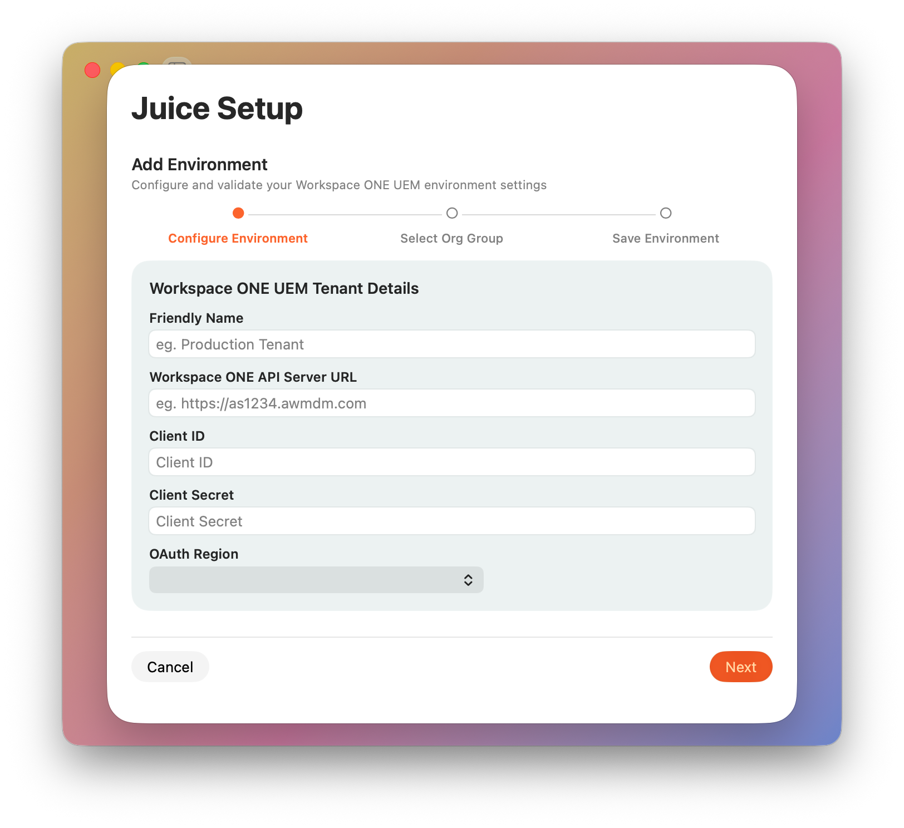

# Getting Started

### Required Settings

When you run Fetch for the first time, you will need to enter the following settings.

| Setting               | Description                                                                                            | Notes                                                                                                                                        |
|:----------------------|:-------------------------------------------------------------------------------------------------------|:---------------------------------------------------------------------------------------------------------------------------------------------|
| Friendly Name         | Any text based value you wish to help identify the environment                                         |                                                                                                                                              |
| Console URL           | Your UEM environment API Server   (eg. `https://as1234.awmdm.com`)                                 | Ensure you use _`asXXXX`_ not _`cn`_ or _`ds`_                                                                                               |
| Client ID             | An OAuth Client ID generated from the UEM Console                                                      |                                                                                                                                              |
| Client Secret         | An OAuth Client Secret generated from the UEM Console                                                  |                                                                                                                                              |
| OAuth Environment URL | Your region’s OAuth Authentication Environment                                                         | Find yours [here](https://docs.vmware.com/en/VMware-Workspace-ONE-UEM/2209/UEM_ConsoleBasics/GUID-BF20C949-5065-4DCF-889D-1E0151016B5A.html) |

>### ℹ️ Notes
> - Application Configuration is saved to:  
> `/Users/{your username}/.juice/LocalSettings.json`
> 
> 
> - Org Group Name, Org Group ID and Org Group UUID will be retrieved automatically from Workspace ONE during validation of the settings entered above.
> 
> 
> - No trailing slashes on any of the URLs or file paths as per examples.
> 
> 
> - Upon saving, the Org Group ID and Org Group Uuid will be obtained from the UEM environment.

>### ⚠️ IMPORTANT
>
> Juice stores your provided Client ID and Client Secret securely in the Keychain of your device.

