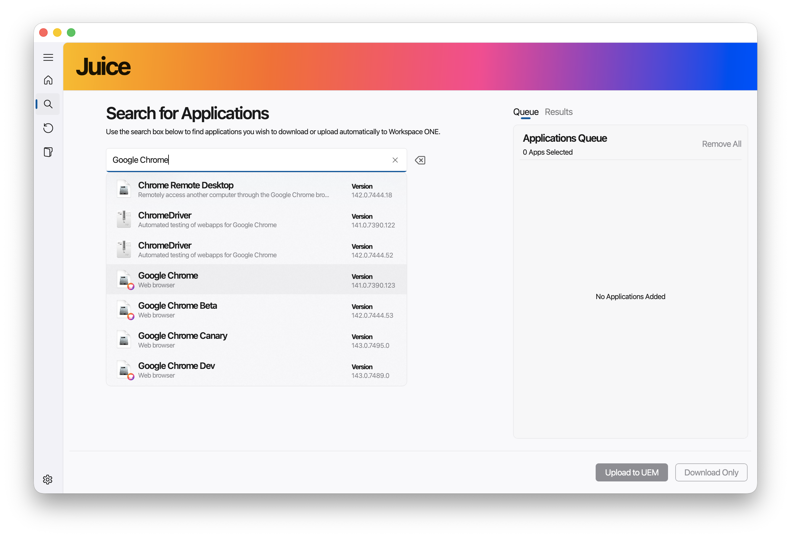

# Usage
{: .no_toc }

### Common Tasks
{: .no_toc .text-delta }

* TOC
{:toc}

 

## Search for Applications

Juice currently has an Application Repository of approximately 7500 native macOS applications in its database that an administrator can search and with a few simple clicks can import automatically into the Workspace ONE catalog, ready for deployment. If an application has a matching Autopkg recipe available, administrators will be shown an option that allows administrators to merge recipe metadata with the generated Munki pkginfo.plist file.

Upon searching and finding a result, an Administrator can see details provided by the Software Vendor about the application, available version, filetype and then add it to the application queue.

## Application Update Management

Juice can query your existing catalog of native macOS Applications already in Workspace ONE UEM and identify any available application updates. If an update to an Application is available in the Juice database, Workspace ONE administrators can select the updated application and automatically upload this to the Workspace ONE UEM Application Catalog.

From here, you have all the same capabilities (such as editing the parsed metadata and importing metadata from a matched recipe) as you would for searching an application.

## Bulk Download for Offline Vulnerability Scanning

After nearly 2 years of collaboration with large enterprises, it is a fundamental requirement that Applications must be scanned and validated by their own security teams. Juice allows for a two-stage process where you can download installers in bulk, have your security teams scan the files, and then import these downloaded Apps back into Juice at a later stage to do the upload into Workspace ONE.

## Bulk Import and Upload

Prior to Juice, processing and uploading of macOS applications into Workspace ONE needed to be done individually. Now Administrators can scan an **existing folder** of native macOS Applications and Juice will process the installers, generate the required metadata files, extract the icons and facilitate the bulk upload of apps into the Workspace ONE App Catalog. Better yet, Juice can import your **own internal applications**, not only those downloaded using Juice, and will scan folders recursively for suitable installers allowing you to import your own local repositories.

## Adding or Editing Metadata

To identify which applications have available metadata, you'll see a coloured pill in the results in Juice.

To add any metadata from a recipe, you can do this after the application has been downloaded in Step 2 of the upload process. Simply click on the Edit button.

## Adding or Editing Application Scripts

Application Deployment using Workspace ONE UEM supports the use of scripts that are processed during certain phases of the application management process. There are 6 script types that can be provided for an Application:

- Pre-Install Script
- Post-Install Script
- Pre-Uninstall Script
- Post-Uninstall Script
- InstallCheck Script
- UninstallCheck Script

During the upload process, you can *edit* the application metadata and the edit screen allows you to add text contents of these scripts in the UI or if there is a matching recipe and the recipe contains these scripts, you can import directly from the recipe.

Also, if you already have these scripts prepared for your already downloaded application, you can place these scripts in the root directory alongside your installer and Juice will automatically import them. 

>### ℹ️ Important
>{: .no_toc }
>
> Your scripts *must* be named as below in order for Juice to automatically import them. Note that these scripts can either be save as .sh or .txt
> 
> preinstall_script(.sh/.txt)
> postinstall_script(.sh/.txt)
> preuninstall_script(.sh/.txt)
> postinstall_script(.sh/.txt)
> installcheck_script(.sh/.txt)
> uninstallcheck_script(.sh/.txt)

>### ℹ️ Note
>{: .no_toc }
> In order for the script content to be added to the metadata.plist file, you must "edit" the application metadata in Step 2 of the upload process. Simply placing the scripts in the directory **will not** add the script contents as a security measure.
